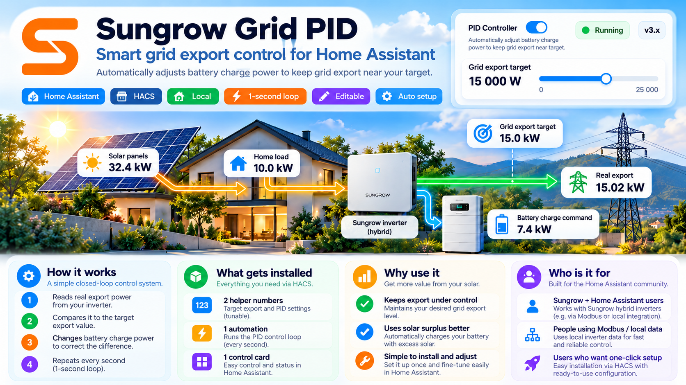

<div align="center">

# ☀️ Sungrow Grid PID

### Smart grid export control for Home Assistant

**Use excess solar energy to charge your battery while regulating power exported to the grid.**



[](https://www.home-assistant.io/)
[](https://hacs.xyz/)
[](https://github.com/EvgenyKrinets/sungrow-grid-pid/releases)
[](LICENSE)

[**Installation**](#-installation) · [**How it works**](#-how-it-works) · [**Configuration**](#-configuration) · [**Troubleshooting**](#-troubleshooting)

</div>

---

## ⚡ What is Sungrow Grid PID?

**Sungrow Grid PID** is a community-built Home Assistant integration that helps regulate grid export by adjusting the inverter's **maximum battery charging power**. It compares your current export reading with the desired grid export target, then changes the charge-power command to reduce the difference.

This is useful for a Sungrow hybrid inverter when solar energy can be divided between the home, grid export, and battery charging.

> **Note:** The illustration above is a conceptual example. Displayed power values are illustrative, not live readings or guarantees of inverter output. This is a simple integral-based controller, not a full proportional–integral–derivative implementation.

## ✨ Features

| Feature | Description |
| --- | --- |
| 🎯 **Grid export target** | Set the desired export power with a slider |
| 🔋 **Battery charging control** | Updates the maximum charge-power entity in Home Assistant |
| 🔁 **One-second adjustment** | Original, user-editable Home Assistant automation |
| 🧩 **Native helpers** | Uses standard `input_number` entities |
| ⏯️ **PID ON/OFF** | Toggle the Home Assistant automation directly from the Lovelace card |
| 🔧 **Editable entities** | Choose the export sensor, battery charge control, and Sungrow scene |
| 🏠 **Local automation** | Runs inside your own Home Assistant instance |
| 📦 **HACS installation** | Install integration files using HACS |

## 🧠 How it works

```text
Solar PV ───┬──► Home consumption
            ├──► Grid export ──► sensor.export_power
            └──► Battery charging ◄── number.battery_max_charge_power
                                          ▲
                                          │
Target (input_number.pid_grid_target) ──► PID automation
                                          ▲
                                          │
Memory (input_number.pid_integral) ◄──────┘
```

Every second, the automation reads the grid export and target:

```text
error      = actual_grid_export - export_target
new_output = previous_output + error × 0.10
new_output = clamp(new_output, 0, 25000)
```

It writes `new_output` to the configured charging-power `number` entity and also stores it in `input_number.pid_integral`.

- **Actual export above target:** battery charge-power command increases.
- **Actual export below target:** battery charge-power command decreases.
- **PID off:** the automation stops changing the charging-power command; turning it off does **not** automatically reset charging power to zero.

The controller's behavior depends on the sign convention and response of the selected export sensor and charge-power entity. Verify those before enabling.

## 📦 Installation

1. In **HACS**, add `https://github.com/EvgenyKrinets/sungrow-grid-pid` as a custom **Integration** repository (if it is not already available).
2. Install **Sungrow Grid PID** and **restart Home Assistant**.
3. Go to **Settings → Devices & services → Add integration → Sungrow Grid PID**.
4. Confirm the pre-filled entity IDs or choose matching entities from the selectors.
5. Complete setup. Existing native PID helpers are preserved; missing ones are set up by the installer.
6. If helpers were newly created, **restart Home Assistant once more** to make them available.
7. Find **Simple Grid Battery Controller** under **Settings → Automations & scenes**, and the **Sungrow Grid PID** dashboard/card in Home Assistant.

**Before enabling:** verify the automation is loaded, the export reading is valid, the target is within the permitted export limit, and no second PID automation is controlling the same charge-power entity.

### ⚙️ Configuration

Default values match the original Sungrow setup and can be changed through integration settings:

| Setting | Default |
| --- | --- |
| Grid export sensor | `sensor.export_power` |
| Maximum battery charge power | `number.battery_max_charge_power` |
| Scene activated on PID enable | `scene.self_consumption_mode_max_battery_discharge` |
| Grid target helper | `input_number.pid_grid_target` |
| PID integral helper | `input_number.pid_integral` |
| Target range | 0–17,000 W, 1,000 W step |
| Output range | 0–25,000 W |
| Feedback gain | 0.10 |
| Update interval | 1 second |

The integration uses an **ordinary editable Home Assistant automation** named `Simple Grid Battery Controller`. It does **not** run the PID calculation through a separate background Python PID loop.

### 🎛️ Dashboard card

The compact `custom:sungrow-grid-pid-card` displays:

- **PID automation** — ON/OFF switch, linked to `automation.simple_grid_battery_controller` by default
- **Grid export target** — slider linked to `input_number.pid_grid_target`
- **Actual grid export** — from `sensor.export_power`
- **Battery charge command** — from `number.battery_max_charge_power`

If your automation has a different entity ID, select the correct `automation.*` entity in the card editor. The same applies to the other entities.

## 🛟 Troubleshooting

| Problem | What to check |
| --- | --- |
| Card says **automation not found** | Confirm the automation exists and its real entity ID matches the card configuration |
| Integration shows a red error | Open **Settings → System → Logs** and check entries mentioning `sungrow_grid_pid` |
| Card still looks old after HACS update | Restart Home Assistant and hard-refresh the browser (Ctrl+Shift+R) |
| No helpers visible | Restart HA after first-time helper creation |
| Automation not loaded | Check that `configuration.yaml` includes `automation: !include automations.yaml` and review automation errors |
| PID seems to work in the wrong direction | Verify that positive `sensor.export_power` means exporting power |

## ⚠️ Safety and limitations

- **Always obey your utility export limit** and inverter/battery charging specifications. This software is not an export-limit protection system or certified grid control.
- PID uses frequent entity updates; recorder/history load can grow if the integral helper changes every second.
- If the controller is disabled or Home Assistant goes offline, the last inverter charge limit may remain active.
- The current installer preserves pre-existing helpers and automations instead of deleting or overwriting user-maintained configuration.
- Actual integration behavior can vary with Home Assistant releases and specific Sungrow integrations. Test with supervision before relying on automatic charging decisions.

## 🗑️ Uninstall

Remove **Sungrow Grid PID** from **Settings → Devices & services**, then uninstall its files in **HACS**. Native helpers and editable automations may remain intentionally; remove those separately after ensuring nothing else uses them.

## ❤️ Community

Issues, bug reports, and contributions are welcome:

- [Report an issue](https://github.com/EvgenyKrinets/sungrow-grid-pid/issues)
- [View releases](https://github.com/EvgenyKrinets/sungrow-grid-pid/releases)

---

<div align="center"><sub>Community project for Home Assistant. Not an official Sungrow or Home Assistant product.</sub></div>
