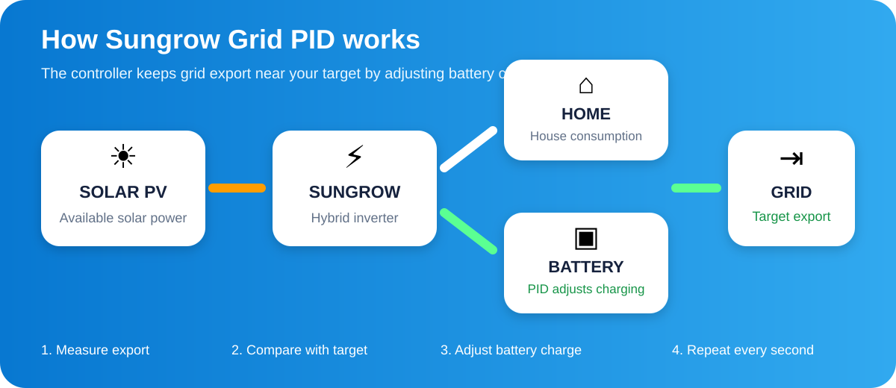

<div align="center">

# ⚡ Sungrow Grid PID

### Smart grid-export control for Home Assistant + Sungrow


**Keep export close to your chosen limit and send the extra solar power to the battery instead of wasting it.**

</div>



## 🌞 What does it do?

Imagine your grid export limit is **15,000 W**. Your solar system is producing power for the house, the grid and the battery.

Sungrow Grid PID watches the **real export power** every second. It compares that value with your **Grid Target** and changes the battery charge command so the export stays close to the target.

> **In simple words:** export first at the level you choose; use the battery to absorb the excess.

### Example

If the target is **15,000 W** and export rises above it, the controller increases battery charging. If export falls below the target, it reduces battery charging. This continuously follows changes in solar production and house consumption.

## 🔄 Simple operating principle

| Step | What happens |
|---|---|
| **1 · Measure** | Reads the real Sungrow grid export power. |
| **2 · Compare** | Compares export with your Grid Target. |
| **3 · Correct** | Raises or lowers the battery charge command. |
| **4 · Repeat** | Recalculates every **1 second**. |

## 🎯 Why use it?

☀️ **Use more available solar energy** — excess power can charge the battery instead of simply being curtailed.

⚡ **Keep export near your chosen value** — useful when the utility/grid connection has an export limit.

🔋 **Charge the battery from surplus** — battery charge is dynamically adjusted according to the export error.

🏠 **React to house load changes** — when the house suddenly consumes more or less, the controller continuously corrects its output.

## 🎛️ Dashboard card

The integration includes its own **Sungrow Grid PID** Lovelace card. After installation you can add it to any Home Assistant dashboard.

The card provides:
- **PID Controller** ON/OFF
- **Grid Target** slider
- current **Grid Export**
- **PID Output**
- **Grid Error**
- **Battery Charge Command**
- Running/Stopped status
- installed version

## 🚀 Installation with HACS

1. Open **HACS → Integrations → ⋮ → Custom repositories**.
2. Add `EvgenyKrinets/sungrow-grid-pid` as **Integration**.
3. Install **Sungrow Grid PID**.
4. Restart Home Assistant.
5. Go to **Settings → Devices & services → Add integration → Sungrow Grid PID**.
6. Open any dashboard → **Edit → Add card → Sungrow Grid PID**.

No manual YAML card and no manual PID entity IDs are required.

## 🔋 What happens when PID is enabled?

When **PID Controller** is turned on, the integration remembers the current battery mode and selects **Force discharge / Forced discharge** as required by the Sungrow control method used by this controller.

When PID Controller is turned off normally, the previous battery mode is restored.

## 🧠 The algorithm

The control logic intentionally remains simple:

```text
error  = export_power - grid_target
output = previous_output + error × 0.10
output = clamp(output, 0, 25000 W)
```

The calculation runs once per second.

For example, if actual export is higher than the target, the output rises and allows more battery charging. If actual export is lower, the output falls.

## 🧩 Requirements

- Home Assistant
- [Sungrow iSolarCloud integration](https://github.com/KRoperUK/sungrow-hass)
- local Sungrow/Modbus export-power entity
- battery charge-power control entity

## 📡 Entities created

| Entity | Purpose |
|---|---|
| **PID Grid Controller** | Starts/stops the controller |
| **PID Grid Target** | Desired grid export, 0–25,000 W |
| **PID Output** | Current controller output |
| **PID Grid Error** | Difference between real export and target |
| **Sungrow Grid PID Version** | Installed integration version |

## ⚠️ Current control philosophy

Version **1.2.0** deliberately keeps the controller behavior already tested in the original Home Assistant automation. It does **not** add adaptive surplus search, Import Guard, D-term or other automatic control strategies.

---

<div align="center">

### Sungrow Grid PID · v1.2.0

Made for local, fast Sungrow control in Home Assistant.

</div>
